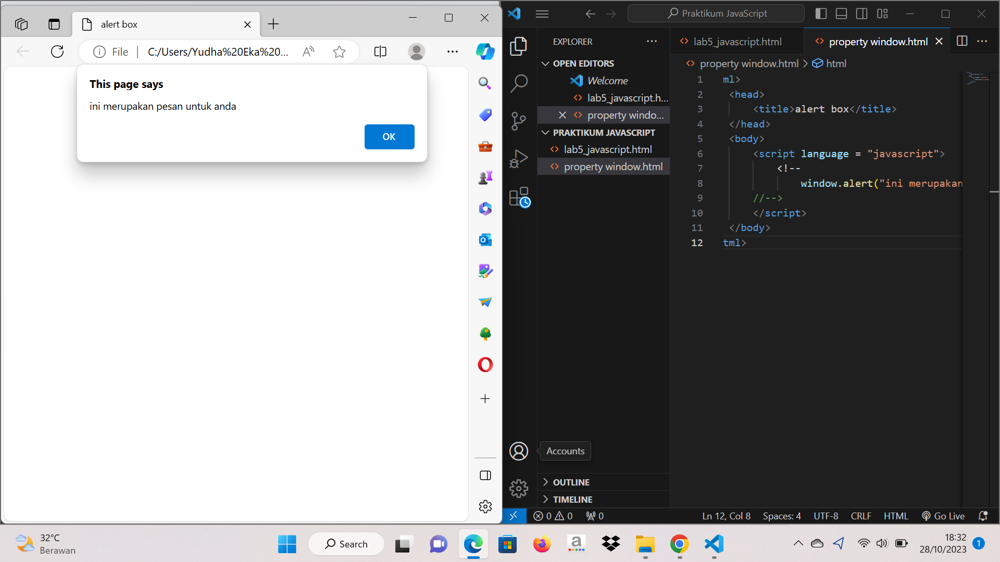

# Praktikum-5-JavaScript

.png)

#Pemakaian Alert sebagai property window.

#Pemakaian method dalam objek

.png)

#Pemakaian Prompt

.png)

.png)

#Pembuatan fungsi dan cara pemanggilannya

.png)

#Operasi dasar aritmatika

.png)

#Seleksi kondisi (if..else)

.png)

.png)

#Penggunaan operator switch untuk seleksi kondisi

.png)

.png)

#Form Input

.png)

#Form Button.

.png)

.png)

.png)

.png)

.png)

